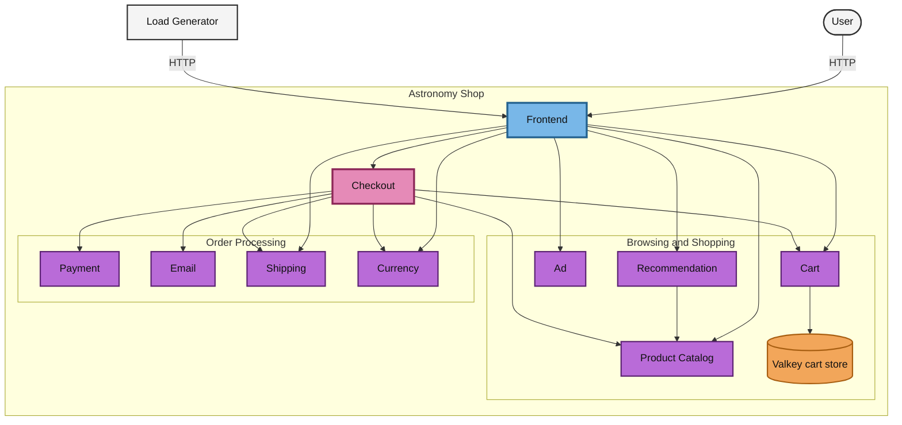

# otel-astronomy-shop

Companion resources for the [KubeSkills](https://kubeskills.com) OpenTelemetry videos, building on the OpenTelemetry Astronomy Shop demo.

## About the upstream demo

This repo is **not** a fork, replacement, or repackaging of the Astronomy Shop. It builds on top of the official OpenTelemetry Demo for learning purposes: walking through how the demo is put together and how to run it on Kubernetes.

The demo, its source code, and its documentation belong to the OpenTelemetry project. For the authoritative version, start here:

- [OpenTelemetry Demo documentation](https://opentelemetry.io/docs/demo/) (official docs)
- [Kubernetes deployment guide](https://opentelemetry.io/docs/demo/kubernetes_deployment/)
- [open-telemetry/opentelemetry-demo](https://github.com/open-telemetry/opentelemetry-demo) (source, Apache-2.0)

Material in this repo is derived from the upstream demo and may drift from it over time. When something here disagrees with the official docs, the official docs are correct.

Copied or derived files carry Apache-2.0 attribution to The OpenTelemetry Authors. See [NOTICE](NOTICE) and [third_party/opentelemetry/LICENSE](third_party/opentelemetry/LICENSE).

## Service overview

A simplified view of how a request moves through the shop's services. For the full picture, including the frontend proxy, Kafka consumers, feature flags, and the telemetry pipeline, see the [architecture diagram](docs/architecture/README.md).

## Docs

- [Architecture diagram](docs/architecture/README.md)
