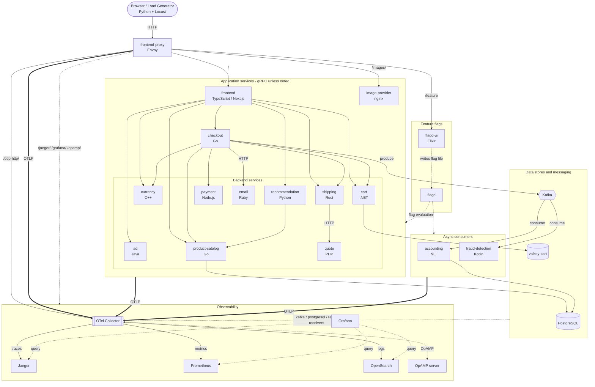

# Astronomy Shop architecture

Architecture of the [OpenTelemetry Demo](https://github.com/open-telemetry/opentelemetry-demo) (Astronomy Shop), derived from its Compose files, Envoy routes, and Collector configs rather than from the upstream docs.



- `architecture.mmd`: Mermaid source (edit this)
- `architecture.svg` / `architecture.png`: rendered output for slides and video

Mermaid also renders inline on GitHub:



## Reading the diagram

| Line style | Meaning |
|---|---|
| Solid | Request path (gRPC unless labeled HTTP) |
| Thick `==>` | OTLP telemetry export to the Collector |
| Dotted | Control plane or scrape: feature-flag evaluation, Collector receivers, Grafana queries, OpAMP |

## Telemetry pipeline

All instrumented services send OTLP to a single Collector (contrib distribution, gateway role). With `compose.observability.yaml` layered on, it fans out to:

| Signal | Exporter | Backend |
|---|---|---|
| Traces | `otlp_grpc/jaeger` (and `span_metrics` connector) | Jaeger |
| Metrics | `otlp_http/prometheus` | Prometheus |
| Logs | `opensearch` | OpenSearch |

The Collector also scrapes Kafka, PostgreSQL, Valkey (redis receiver), and Docker stats. Browser telemetry reaches it through Envoy at `/otlp-http/`.

## Caveats

- **Compose layering:** the base `compose.yaml` does not include Kafka, `accounting`, or `fraud-detection`. They come from `compose.full.yaml`. Jaeger, Prometheus, Grafana, OpenSearch, and OpAMP come from `compose.observability.yaml`. The diagram shows the fully layered stack.
- **Simplified edges:** flagd is consumed by nearly every service and the load generator via OpenFeature. Drawing each edge produced unreadable output, so it is shown as one edge to the app and async groups.
- **Snapshot:** generated from upstream `main` on 2026-09-28. Upstream changes often (for example `chatbot`, `mcp`, and `agent` services exist under `src/` but are not drawn). Re-verify before recording a video against a pinned demo version.

## Regenerating

```bash
npx -y @mermaid-js/mermaid-cli -i architecture.mmd -o architecture.svg -b white
npx -y @mermaid-js/mermaid-cli -i architecture.mmd -o architecture.png -b white -s 2
```

If Puppeteer cannot find a browser, pass `-p` with a config JSON containing `executablePath` for a local Chrome.
